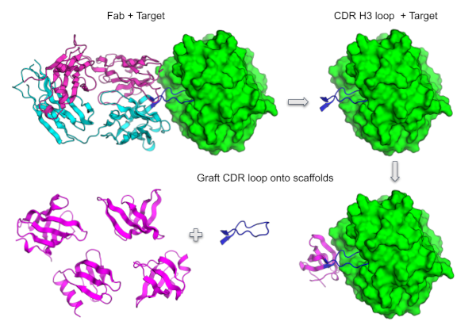

# Autograft



## Description
Autograft is a python script package that can identify a beta-hairpin loop that interacts with a target protein from a PDB complex and attempts to graft the loop onto a set of scaffolds in context of the target. An example application is to graft the CDR H3 loop from an antibody+target complex onto mini protein scaffolds for protein protein interface (PPI) design taking advantage of the H3+target interactions while hopefully enabling the design of additional interactions to the target from the scaffold.   

## Installation
You can clone this repo into a preferred destination directory by going to that directory and then running:

`git clone https://github.com/davidekim/autograft.git`

## Usage
auto_graft.py is the main script and requires a single input json file. An optional argument can be provided to parallelize the run on the digs.

`python ./auto_graft.py <json input file> [scaffolds per sbatch array job (min 100)]`

### The python environment
The script uses PyRosetta.

### Json input file
The input file should contain the following configurable parameters:

```json
{
    "target_complex_pdb": "path/to/complex",
    "graft_chain": "PDB chain id of chain containing loop to graft",
    "scaffolds_paths": [
        "path/to/scaffold/set1 (may be a directory with PDBs or a list)",
        "path/to/scaffold/set2"
    ],
    "output_path": "path/to/output"
}
```
The following additional parameters (with default values) are optional:

-  `"GRAFT_STRAND_LEN": 3`
The length of each segment of the graft point (a pair of segments like a strand pair) for superposition
- `"MAX_RMSD": 1.5`
The maximum rmsd for graft point superposition.
- `"MAX_SCAF_REPLACEMENT_LEN": 10`
The maximum number of scaffold residues that can be replaced by the graft
- `"MAX_GRAFT_LEN": 20`
The maximum number of graft residues in the loop to graft
- `"MAX_STRAND_PAIRS": 3`
The maximum number of graft points per loop differing by a residue shift to superimpose, starting from the closest to the target.
-  `"MAX_STRAND_PAIR_CONTACT_DISTANCE": 15`
Distance threshold to target for finding potential graft points.
-  `"MAX_CONTACT_DISTANCE": 8`
Distance threshold defining a contact (less than this value); higher values get graft points further from the target. 
-  `"MAX_GRAFT_POINT_CONTACTS": 5`
Maximum contacts graft point residues have with target for choosing graft point; higher values get graft points closer to the target.
-  `"MIN_GRAFT_CONTACTS": 10`
Minimum number of contacts the graft must have with the target.
-  `"SHIFT_STRAND_PAIRS_BY": 0`
Shift the graft point closer by this number of residues.

### Output
The results are saved in the "output_path" and the grafts are located at:
`output_path/*/*idealized.pdb` 

## Support
Contact David Kim (dekim@uw.edu) for any questions.

## Authors and acknowledgment
This work was conceptualized and developed by David Kim (dekim@uw.edu), Pat Erickson (pwe@uw.edu), and Thomas Schlichthaerle (thomschl@uw.edu).

